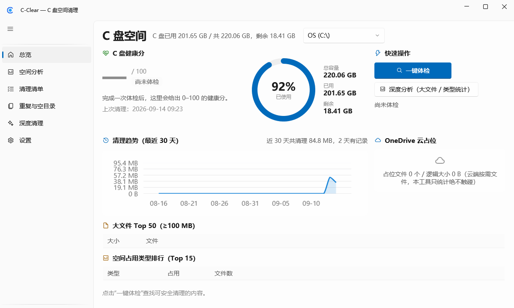
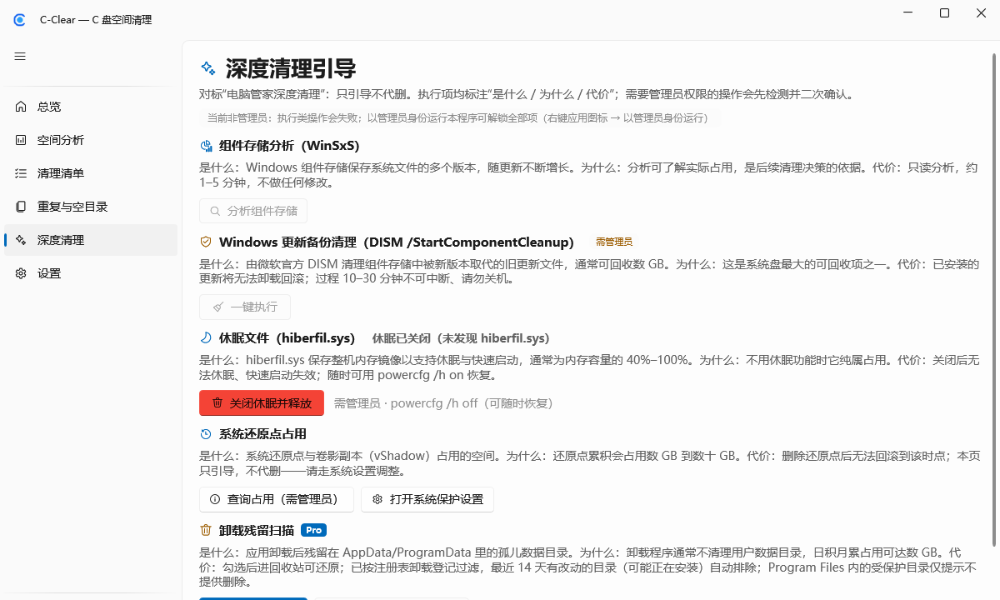
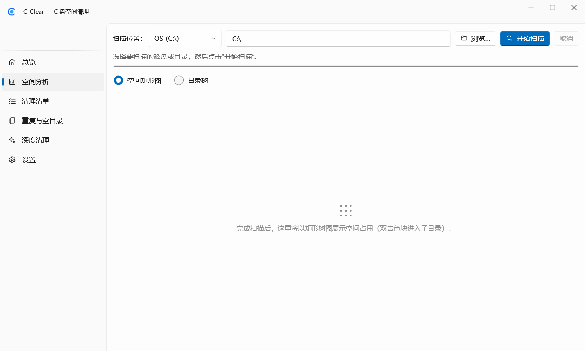
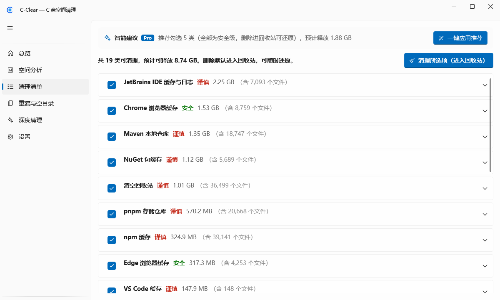

# C-Clear — Windows C 盘空间清理工具

C-Clear 是一款面向 Windows 10/11 的开源磁盘清理工具，聚焦一个目标：**让你看清 C 盘（以及 D/E 等其他固定盘）空间被谁占用，并安全地清理掉真正可以清理的内容**。

```
扫描 C 盘 → 告诉你空间被谁占用 → 自动识别可安全清理的内容
→ 你确认 → 清理 → 显示实际释放的空间
```

优先级：**简单 > 稳定 > 安全 > 扫描快**。

## 截图

<!-- V2 Fluent 界面截图（docs/screenshots/），深浅色主题跟随系统 -->

| 总览仪表盘（健康分 + 磁盘环形图） | 深度清理引导 |
|---|---|
|  |  |

## 截图（V3）

| 空间矩形树图（WinDirStat 式，可钻取） | 智能清理建议（一键应用推荐） |
|---|---|
|  |  |

## 功能（V3）

- **Fluent 界面**：WPF-UI 4.x（Win11 观感、Mica 背景、NavigationView 侧栏导航），浅色 / 深色 / 跟随系统三态主题
- **总览仪表盘**：C 盘健康分（0–100，综合 Safe 可清理量 / 重复浪费 / 上次清理时间）、磁盘占用环形图、大文件与类型统计
- **空间分析**：并行扫描目录树（全 C 盘 1.5M 文件约 45 秒 / NVMe），大文件 TopN、扩展名统计、实时吞吐、目录树图标（目录/文件/云占位/联接）
- **空间矩形树图（V3 旗舰）**：WinDirStat 式 Squarified 树图，颜色按扩展名稳定映射、图例、悬停显示路径与大小，双击钻取子目录 + 面屑返回；153 万条目布局计算 1ms、400 块护栏防卡顿
- **多盘支持（V3）**：总览 / 空间分析 / 体检可选 C/D/E… 固定盘；黑名单对各盘 Users 目录同样生效；历史与趋势按盘区分
- **一键体检**：内置规则包自动识别可清理内容，按 安全/谨慎/手动 三级展示"是什么、为什么安全、重建代价"
- **系统清理**：用户/系统临时文件（>72h）、缩略图缓存、崩溃转储、错误报告、着色器缓存、Windows 更新缓存（自动停/启服务）等
- **开发缓存专项**：npm / pnpm / yarn / pip / poetry / uv / Gradle / Maven / NuGet / Cargo / HuggingFace / JetBrains / VS Code / Docker 缓存，**官方 CLI 优先**（如 `npm cache clean --force`），CLI 不可用时回退目录删除
- **浏览器缓存**：Edge / Chrome / Firefox 缓存，浏览器运行中自动跳过
- **重复文件**：三级漏斗（大小分组 → 首尾 4KB 预哈希 → 全量 SHA-256），默认保留最旧一份
- **空目录**：自底向上折叠，一次删除整条空目录链
- **回收站清理**：按卷统计大小，经 Shell API 清空（带二次确认）
- **清理历史与趋势**：每次清理按规则写入 `history.jsonl`，总览页 30 天释放量趋势图
- **在线规则包**（实验性）：托管于 GitHub Releases，SHA256 校验 + HTTPS 下载，失败静默回退内置包（每条规则仍受硬编码黑名单约束）
- **每周自动清理**：Windows 计划任务到点执行"体检 + 仅安全级清理"，进回收站、写审计日志，无常驻后台
- **深度清理引导**：组件存储分析（DISM）、Windows 更新备份清理（需管理员 + 二次确认）、休眠文件（powercfg）、系统还原点占用——只引导不代删
- **OneDrive 云占位统计**：只读元数据统计占位文件数与逻辑大小，绝不触发下载
- **智能清理建议（Pro）**：对体检结果按安全级别/释放量/文件年龄打分，一键勾选推荐项（谨慎级仅推荐全部文件超过 30 天的）
- **卸载残留扫描（Pro）**：读注册表卸载登记与 AppData/ProgramData 比对找已卸载应用孤儿目录；同名进程/系统目录/活跃应用多重防误报；只引导、勾选后进回收站
- **满盘预测与周报（Pro）**：每日计划任务采样剩余空间，线性回归预测"N 天后满盘"（采样不足自动隐藏）；HTML 周报导出（KPI/趋势图/Top10 大文件/建议）
- **自动清理高级触发（Pro）**：登录后 15 分钟（计划任务 LogonTrigger）+ 剩余空间低于阈值（每日采样判定后拉起，同天一次防抖），依旧无常驻
- **下载重复检测（Pro）**：识别 Downloads 里 setup.exe / setup (1).exe 式重复下载，每组默认保留最新一份

## 安全设计（不可妥协）

1. **全局黑名单硬编码于清理器**：`Windows\Installer`、`WinSxS`、`Program Files`、用户桌面/文档/图片/视频/下载、OneDrive 同步根、`pagefile.sys` 等——**任何规则 JSON 都无法覆盖**（含在线更新的规则包）
2. **默认进回收站**：删除经 Shell API（FOF_ALLOWUNDO），可随时还原；永久删除需在设置中显式开启 + 每次清理二次确认；自动清理固定回收站模式且只跑安全级规则
3. **占用预检**：独占打开 + 就地重命名双重测试，被占用文件 0 强删，全部进跳过清单
4. **junction/symlink 不跟随、不删除**；OneDrive 云占位文件只读元数据、永不触发下载
5. **全量 JSONL 审计日志**（`%LOCALAPPDATA%\C-Clear\logs\`），每次删除可逐条回查
6. **释放量报真实值**：按 `GetDiskFreeSpaceEx` 执行前后差值统计（回收站模式显示"移入回收站字节数"，因为空间要清空回收站后才到账）
7. **扫描永远只读**；清理只操作规则/勾选命中的集合

## 开源与商业化

开源核心**全功能免费**（MIT）：体检、清理、空间矩形树图、多盘支持、每周自动清理、重复文件与空目录——**永不缩水**。

**Pro ¥49 永久买断**（无订阅、无广告、无推广弹窗）：智能清理建议、卸载残留扫描、满盘预测与周报、自动清理高级触发、下载重复检测、云规则快推、优先 issue 响应。Pro 入口在界面上始终可见（带 Pro 徽标，点击查看引导卡），功能先放后收；采用离线 Ed25519 授权码（`设置 → 关于 → 导入许可证` 即刻解锁），**无联网 DRM**——机制说明见 [docs/商业化-授权机制.md](docs/商业化-授权机制.md)。

## 运行要求

- Windows 10 2004 (19041)+ / Windows 11，x64（推荐 Windows 11 以获得 Mica/Fluent 完整观感；LiveCharts2 图表依赖链要求 19041+）
- 无需安装 .NET（单文件自包含发布）
- 部分系统级清理项（Windows 临时、更新缓存等）需要管理员权限运行；普通权限下会自动跳过并提示

## 构建与发布

```bash
dotnet build                       # 构建
dotnet test                        # 运行测试（xunit，149 用例）
dotnet publish src/Cclear.App -c Release -r win-x64 --self-contained \
  -p:PublishSingleFile=true -o publish    # 单文件发布
```

CI（`.github/workflows/ci.yml`）：windows-latest 上 build + test。
Release 工作流（`release.yml`）：推送 `v*` 标签时自动构建并上传单文件 exe 与规则包（`rules-pack-v1.json`）。

## 项目结构

```
src/Cclear.Core/       核心库（无 UI 依赖，全部可单测）
  Scanner/             IScanner + ManagedTreeScanner（+W6 MftScanner POC）
  Rules/               规则模型、JSON 规则包加载、路径展开、glob、在线规则包（版本+SHA256）
  Rules.Builtin/       内置规则包（28 条，嵌入资源，支持外部目录热加载）
  Analyzer/            体检引擎：规则 × 文件系统 → CleanPlan
  Cleaner/             清理执行器 + 全局黑名单 + 审计日志 + CLI 执行器
  History/             清理历史（history.jsonl，V3 按盘区分）+ 审计回读 + 30 天趋势聚合
  Analysis/            空间分析 + Squarified 矩形树图布局（TreemapLayout）
  Advisor/             智能清理建议（打分推荐引擎）
  Leftovers/           卸载残留扫描（注册表卸载登记 × 数据目录比对）
  Trend/               空间采样 + 满盘线性回归预测 + 每日采样计划任务
  Reporting/           HTML 周报生成（自包含单文件 + 内联 SVG）
  AutoClean/           计划任务自动清理（Task Scheduler COM + 无头模式 + V3 多触发器）
  DeepClean/           深度清理引导（DISM / powercfg / vssadmin）
  Cloud/               OneDrive 云占位统计（只读元数据）
  Licensing/           Ed25519（RFC 8032）+ 离线许可证验证
  Win32/               卷信息 / 回收站 / 服务控制 / 权限检测
src/Cclear.App/        WPF 前端（MVVM，CommunityToolkit + WPF-UI 4.3 Fluent）
tools/RulesPackTool/   规则包生成工具（内置规则 → rules-pack-vN.json + SHA256）
tools/LicenseTool/     授权码工具（keygen / sign / verify）
rules-pack/            规则包产物（随 Release 分发，社区规则接受 PR）
tests/Cclear.Core.Tests/  xunit 测试（红线回归都在这里）
```

## 技术说明

- **MftScanner（POC）**：`FSCTL_ENUM_USN_DATA` 直读 USN_RECORD 建树，需管理员。POC 限制：USN_RECORD 不含文件大小（SizeBytes=0），因此不接入默认 UI；需要精确大小请使用默认的 API 枚举扫描器。
- **删除引擎**：使用 `SHFileOperationW(FOF_ALLOWUNDO)`（计划中的 IFileOperation 在部分机器对进程外调用方挂起，按"安全>简单"改道，见 PROJECT_PLAN 变更记录）。
- **UI 框架**：WPF-UI (lepoco) 4.3.0（MIT）。新依赖理由见提交记录与 V2 计划 §1.1。
- 清理策略测试矩阵：Win10 21H2/22H2、Win11 23H2/24H2 × 管理员/标准用户（建议 VM/沙盒验证）。

## License

MIT（见 [LICENSE](LICENSE)）
